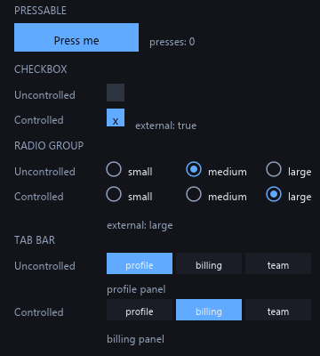

# Aether

**A headless UI framework for Luau. One component runs across engines, desktop runtimes, and CI.**

---

Most Luau UI libraries depend on game engine runtime internals for layout, input, and focus. Aether doesn't. **Layout, hit testing, pointer arbitration, focus, motion, and text editing all run in pure Luau**, allowing identical UI components to execute across multiple environments:

- inside game engine viewports,
- on the desktop through [Dew](https://github.com/dew-desktop/dew), a native Rust host,
- headlessly in CI, where interactions and layout can be verified in automated pipelines without launching a graphics engine.

A *host* binds Aether's abstract geometry to concrete rendering surfaces. `Host.detect()` resolves the active host by probing environment capabilities rather than relying on manual configuration.

## Highlights

- **Headless primitives.** Pressable, Checkbox, RadioGroup, Tabs, Slider, Dialog, Combobox, ContextMenu, Tooltip, TextInput, ScrollArea, TreeView, and VirtualList. Each primitive handles state and interaction behavior while leaving visual styling completely in your hands.
- **Controlled and uncontrolled state models,** following the [Ark UI](https://ark-ui.com) / [Zag](https://zagjs.com) model: pass a getter to observe and drive state externally, or let the primitive manage state automatically.
- **Pure Luau interaction engine.** `PointerRouter`, `KeysRouter`, `SelectionRouter`, `LayerManager`, `ScreenStack`, and `InputScope` resolve pointer arbitration, hit testing, focus traps, modal stacking, and layer hierarchies without host dependencies.
- **Off-engine text editing.** Cursor position, selection range, character masking, and blinking carets are calculated directly in Luau, ensuring consistent text-editing mechanics across any environment.
- **Reactive foundation.** Deep integration with [vide](https://github.com/centau/vide), featuring spring physics, presence/exit transitions, stagger effects, and floating-element positioning.
- **Rigorous layout conformance.** A suite of 123 data-driven layout cases validates layout parity, asserting bounding boxes, text bounds, flex wrapping, and constraint solving.
- **Enforced architecture boundaries.** Structural gates in CI continuously audit the codebase to ensure layer separation and eliminate unwanted platform coupling.

## License

[MIT](LICENSE)

---

Aether is an independent project and is not affiliated with or endorsed by Roblox Corporation.
